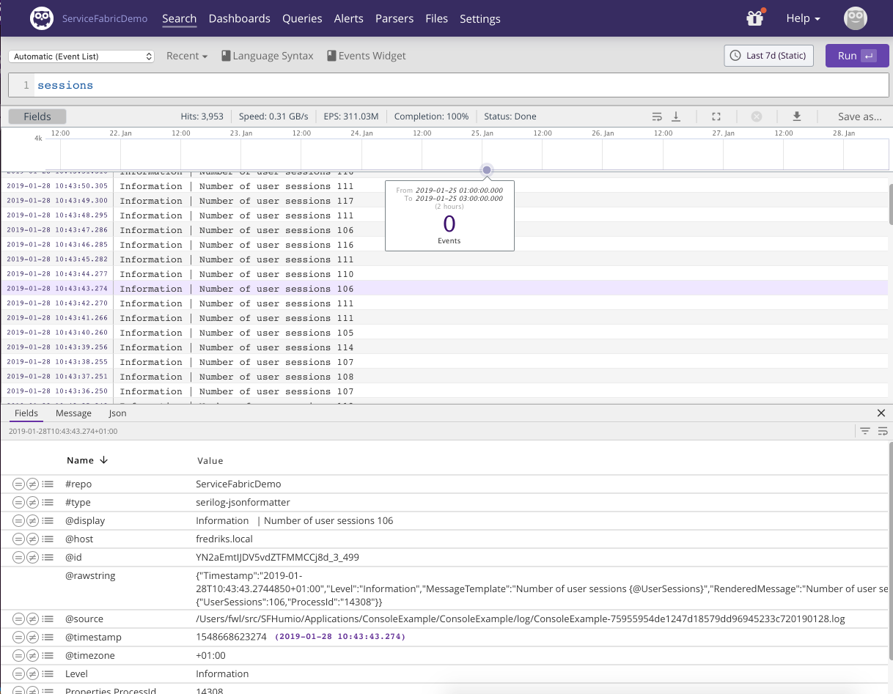
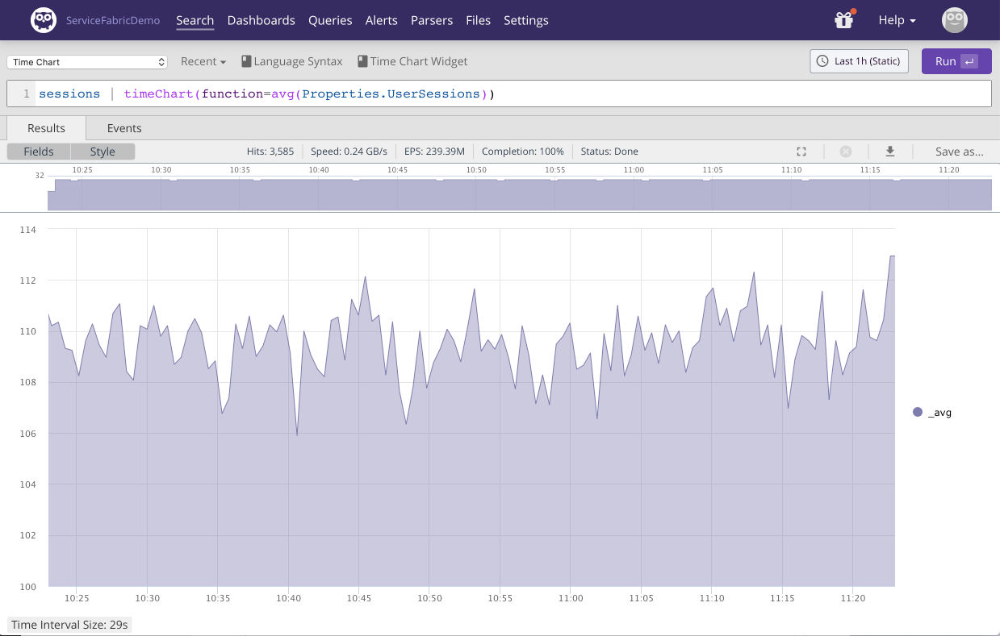

# SFHumio

Azure Service Fabric is a distributed systems platform that makes it easy to package, deploy, and manage scalable and reliable microservices and containers. Developers and administrators can avoid complex infrastructure problems and focus on implementing mission-critical, demanding workloads that are scalable, reliable, and manageable.

Humio is a log management system, which enables you to Log everything, answer anything in real-time. You can send, search, and visualize all logs instantly, easily, and affordably, On-Premises or in the Cloud.

This repo contains source and guides on how to use Humio together with Service Fabric clusters and applications.

**_Disclaimer_**

Not a full solution, just a set of examples - refer to SF docs on how to monitor Service Fabric.

## Problem

Three layers...
Three phases...

### Instrumentation

- OS
  - Performance Counters
- Runtime
  - Syslog, ETW and performance counters
- Application
  - Examples - abundance of logging frameworks and providers

### Collect and ship

- ETW
- EventSource
- Files
- Performance Counters

### Query and analyze


## Solution

### Instrumentation - Solution

- OS
    - Performance Counters
- Runtime
    - ETW Providers
- Applications
    - .net core console: SeriLog --> Files
    - asp.net core: ILogger --> ILoggerProvider for EventSources

#### 


#### Serilog

[Serilog](https://serilog.net) is a popular logging framework for .NET. Serilog is focused on *structured* logging.
Doing structured logging means thinking about how the logs will be searched and analyzed afterwards. E.g. instrumenting
a program with:

```csharp
Log.Information("Number of user sessions {@UserSessions}", userSessionCount);;
```

Should make it easy to aggregate `UserSessions`in your log management system afterwards.
With serilog you can configure where and how your log lines are outputtet. The option we are going to 
choose is writing JSON formatted log lines to files. The above line would read as:

```json
{"Timestamp":"2019-01-28T09:38:08.3192070+01:00","Level":"Information","MessageTemplate":"Number of user sessions {@UserSessions}","RenderedMessage":"Number of user sessions 115","Properties":{"UserSessions":115}}
```

With the following configuration in code:

```csharp
Log.Logger = new LoggerConfiguration()
                .WriteTo.File(formatter: new JsonFormatter(renderMessage: true), rollingInterval: RollingInterval.Day)
                .CreateLogger();
```

Note the `renderMessage: true` part of the configuration. This instructs Serilog to render the message as part of the formatted log output which
ends up in our log files. We are going to exploit a feature in Humio which allows us to display the rendered message instead of the raw json data.
This makes it easier for a human to process the log lines. 

The log file acts as a persistent buffer between your program and your log management system which enables us to handle retransmissions and long
lasting bursts of log lines.

Next, head up to https://cloud.humio.com and create a free account. Alternatively, you can run Humio on your own hardware. See 
https://docs.humio.com/installation/.

// TODO: 

#### Service Fabric Platform Events

// TODO: this should probably be after introduction to Humios query language..

### Parser

For the ETW log lines produced by Service Fabric and shipped by EventFlow we are going to write a custom parser in Humio.
 Humio parsers are written in Humios query language. The Service Fabric log lines contains both structured and unstructured data.
Here's an example:

`{"timestamp":"2019-02-26T10:40:51.0501913+00:00","providerName":"Microsoft-ServiceFabric","level":4,"keywords":1152921504606846977,"payload":{"ID":1284,"EventName":"PerfMonitor","Message":"Thread: 12, ActiveCallback: 1, Memory: 18,223,104, Memory Average: 18,223,104/18,051,085 ","threadCount":12,"activeCallback":1,"memory":18223104,"shortavg":18223104,"longavg":18051085}}`

As the log line stands right now it is ill-fit for a human operator. The `Message` fields is basically a summary of some of the other fields and represents a nice overview. Our parser will instead present this line in Humio:

`2019-02-26 11:40:51.050 | 4 | Microsoft-ServiceFabric | PerfMonitor | 1284 | Thread: 12, ActiveCallback: 1, Memory: 18,223,104, Memory Average: 18,223,104/18,051,085`

In other words, timestamp followed by level, providername, eventname, eventid and message.
The parser code is straightforward:

 ```pascal
parseJson() 
| @timestamp := parseTimestamp(field=timestamp)
| @display := format(format="%s | %s | %s | %s ", field=[providerName, payload.ID, payload.EventName, payload.Message])
| kvParse()
 ```


### Collect and ship - Solution

- ClusterMonitor
    - ETW
    - EventSource
    - Performance Counters
- FileBeat
    - Files

#### Filebeat

We have our logs formatted in JSON and written to files on disk, what's still missing is shipping the logs to Humio.
[Filebeat](https://docs.humio.com/integrations/data-shippers/beats/filebeat/) is a lightweight, cross platform shipper that is compatible with Humio.
Filebeat uses few resources, is easy to install and handles network problems gracefully.

The following filebeat configuration scrapes all logs from `D:\\SvcFab\_App` and subfolders named `log` with files ending in `.log`.
Humio is compatible with the elastic bulk API so we are using `output.elasticsearch`. The `hosts` parameter points to Humio cloud. 
The `INGEST_TOKEN` needs to be replaced by a valid Ingest Token. Ingest Tokens are used in Humio to identify clients, selecting a repository 
for the incoming logs and selecting which parser should be used. 

```yaml
filebeat.inputs:
- type: log
  enabled: true
  paths:
    - "D:\\SvcFab\\_App\\**\\log\\*.log"
  encoding: utf-8

output.elasticsearch:
  hosts: ["https://cloud.humio.com:443/api/v1/ingest/elastic-bulk"]
  username: INGEST_TOKEN
  compression_level: 5
  bulk_max_size: 200
  worker: 1
```

We need to get the `INGEST_TOKEN` from Humio. A default ingest token is configured for your log repository in Humio. Log in to Humio, go to 
your log repository, click Settings and then 'Ingest API Tokens' and either retrieve the default or create a new one.
When you send logs and metrics to Humio for ingestion it needs to be parsed before it is stored in a repository. Humio has a built-in parser 
for Serilog that is configured as above. Make sure the Serilog parser is selected for the ingest token used. This is done by selecting the
parser in the dropdown 'Assigned Parser' next to the Ingest Token.

Starting filebeat can be done with e.g. `filebeat.exe -e -c filebeat.yml`. The `-e` flag instructs filebeat to log to the console which is usefull 
when experimenting with the configuration.


### Query and analyze - Solution

Let's take a look at a simple free text search in Humio:



We have searched for the word `sessions`, the result is displayed below and a specific log line has been selected with the details shown below the event list.

Let's say we want to plot the average number of user sessions the last hour:



Notice the `Properties.UserSessions`. This is a structured part of the Serilog log line that allows for easy analysis.
For any unstructured part of your log data that isn't turned into a property on your events overwise the parser, Humio allows for 
extracting the data using regular expressions which are then added as one or more fields to the events in question. 
This can 


// TODO: or want the days where we at some point had less than..


Humio never rejects incoming logs, even logs it for some reason cannot parse. Doing the search `@error=* | groupBy(@error_msg)` will reveal any events that haven't been properly parsed and group them by reason.


## Repo Structure

All contain a README.md with instructions

- Applications
    - .net core console Guest
    - Reliable Service .net core webapi
- Agents
    - ClusterMonitor
    - FileBeat
- Humio
    - Configuration
    - Queries
    - Dashboards
- Scenarios
    - Upgrade
    - Failure (chaos)
    - Exception hunting
    - Performance
